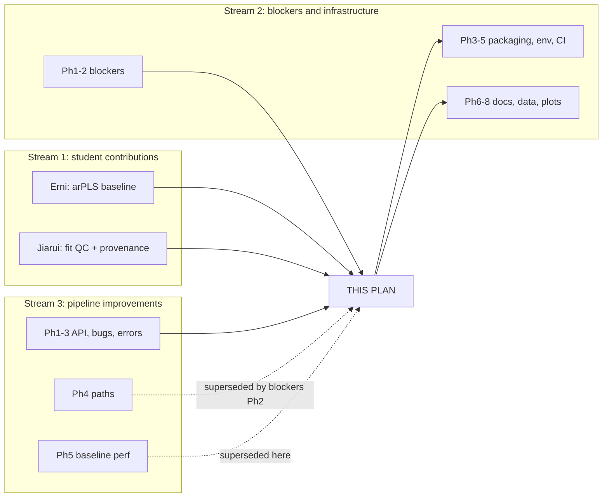

# Implementation Plan: arPLS Baseline and QC-Instrumented Peak Fitting

---
**Date:** 2026-08-07
**Version:** 1.0
**Author:** AI Assistant
**Status:** Draft
**Related Documents:**
- `plan-prospecpy-improvements.md` — pipeline correctness and performance defects. **This plan
  supersedes that plan's Phase 5** (see "Relationship to the other two plans").
- `plan-prospecpy-blockers-and-infrastructure.md` — packaging, environment, documentation.
  **Its Phases 1 and 2 must land before Phase 1 here.**

---

## Overview

Two students extended the tail of the ProSpecPy pipeline on the
[`ada/arPLS-baseline`](https://github.com/ada-eg25/ProSpecPy/tree/arPLS-baseline) branch:

- **Erni** replaced the manual, GUI-tuned baseline step with an automatic algorithm
  (arPLS, from Baek et al. 2015).
- **Jiarui** replaced the one-shot curve fit at the end with a batch fitting pipeline that
  records why each fit passed or failed (design modelled on Fitspy, which is what the
  Quéméré 2024 JOSS paper describes).

Both changes are real improvements over what they replace. Neither is currently mergeable:
the arPLS work is a method bolted onto `ProSpecPy` with no tests and one unexamined
numerical decision; the fitting work is a 1,699-line standalone script outside the package
that communicates with the baseline stage through CSV files on disk.

This plan merges both **as the supported path**, per two decisions taken with the project
owner on 2026-08-07:

1. **arPLS replaces the manual GUI baseline.** The `interact()` threshold/adjustment-factor
   workflow is retired, not kept alongside.
2. **The fitting script is split into the package.** The QC rules and the three provenance
   tables become importable modules callable in-memory; a thin CLI wraps them.

**Goal:** A pipeline whose baseline stage runs without human tuning, whose fitting stage
reports per-peak validity with machine-readable provenance, and where both stages are
tested, documented, and reachable from a notebook without writing intermediate CSVs.

---

## A note to Erni and Jiarui

This plan is mostly a list of things to change in your code. That framing undersells it, so
to be explicit about what is being kept:

**Erni** — the peak-guided weighting in `arpls_baseline_second_deriv_weights` is not in
Baek's paper. Using the already-computed second-derivative peak positions as a prior, so the
baseline is less likely to climb into a real peak, is a genuine and sensible extension. It
stays. The λ sweep in the notebook is exactly the right way to choose that parameter, and
the finding that 1e5 works is the kind of result that belongs in the documentation.

**Jiarui** — the three-table design (`fit_attempts` / `fitted_peaks` / `rule_events`) is the
most valuable thing in either contribution. Going from "here is a fit and an RMSE" to "here
are 12 attempts, 9 passed, 3 flagged, and here is the specific rule each one tripped" is the
difference between a script and an instrument. The table schemas survive this plan
essentially unchanged; what changes is where the code lives and how it is called.

The work below is about making these usable by people who are not you: tests so a future
change cannot silently break them, docstrings so the parameters are discoverable, and
in-memory interfaces so the two halves talk without a filesystem round-trip.

---

## Current State Analysis

All line references are to the `ada/arPLS-baseline` branch unless noted. Verified by
`git diff main ada/arPLS-baseline`.

### What the branch adds

- `src/prospecpy/baseline.py:100-143` — `arpls_baseline(raw_absorbance, lam=1e5, ratio=1e-6,
  max_iter=50)`. Textbook arPLS: builds a second-difference penalty matrix, solves the
  penalised least-squares system, reweights via Baek's logistic function of the
  below-baseline noise, iterates to convergence. **Currently unused** — verified by
  `git grep -n "arpls_baseline\b"`, which returns only the definition.
- `src/prospecpy/baseline.py:146-213` — `arpls_baseline_second_deriv_weights(...)`. The
  function actually called. Same solver, plus a peak-position prior: a `±35`-point window
  around each detected peak is down-weighted to `0.3`, blended with the arPLS weights at
  `alpha=0.8`.
- `src/prospecpy/prospecpy.py:357-455` — `ProSpecPy.subtract_baseline_arpls(lam, ratio,
  max_iter, save, showplot, verbose)`. Calls `raw_spline` once, runs the peak-guided arPLS,
  subtracts, clips, writes `arpls_baseline_subtracted_spectra.png`,
  `arpls_baseline_corrected_data.csv`, `arpls_baseline_corrected_peak_info.csv`.
- `run_whole_pipeline.py` (repo root, 1,699 lines) — Jiarui's standalone CLI. Reads Erni's
  `arpls_baseline_corrected_data.csv` files, windows to 1800–2150 cm⁻¹, fits Gaussian and
  Lorentzian via `scipy.optimize.curve_fit`, applies physical safety checks, writes three
  linked CSV tables plus report plots and a comparison summary.
- `docs/workflow_demo.ipynb` — 412 lines added, 83 removed. Contains a λ sweep over
  1e5/1e6/1e7 settling on 1e5, and a batch loop calling `peak_finder(0.35)` then
  `subtract_baseline_arpls(lam=selected_lam)`.

### What the branch replaces

The current baseline path, which this plan retires:

- `src/prospecpy/interact.py:13-218` — the ipywidgets GUI. Two knobs (`threshold`,
  `adj_factor`) tuned per sample by eye, saved to `interact_input_parameters.csv`.
- `src/prospecpy/prospecpy.py:232-259` — `anchor_point_fit(adjustment_factor)` and
  `baseline_fit()`, which walk outward from each peak to pick between-peak anchor points and
  spline through them.
- `src/prospecpy/prospecpy.py:262-353` — `subtract_baseline()`, the anchor+spline subtraction.
- `src/prospecpy/baseline.py:12-37` — `baseline_spline()`.
- `src/prospecpy/baseline.py:66-94` — `baseline_correction()`, the O(n²) nearest-neighbour
  subtraction that `plan-prospecpy-improvements.md` Phase 5 exists to optimise.

And the current fitting path:

- `src/prospecpy/peak_fit.py:34-77` — `peak_fit()`. Derives initial guesses from
  `peak_widths(..., rel_height=1)`, calls `curve_fit` with default `maxfev`, returns
  `(params, rmse, fig)`. No bounds, no validity checks, no per-peak output.
- `src/prospecpy/peak_fit.py:80-101` — the two batch wrappers, which additionally have the
  transposed `save`/`showplot` bug documented in `plan-prospecpy-improvements.md` Phase 3.

### Defects and gaps in the new code

These are the things this plan fixes. Ordered by how much they matter.

1. **Negative clipping biases the areas Jiarui's fitter consumes.**
   `src/prospecpy/prospecpy.py:385` — `corrected[corrected < 0] = 0`. The old path
   (`baseline.py:88-90`) does the same thing, so this is inherited, not introduced. But the
   consequence is new: `run_whole_pipeline.py` computes `peak_area` from these values
   (`derived_peak_values`, line 762), and clipping removes the negative lobes that a
   slightly-too-high baseline produces. Every area is therefore biased upward by an amount
   nobody has measured. **This is the one genuine numerical concern in the merge.**
2. **No tests for either contribution.** `tests/` contains only `test_import.py`. Neither
   the arPLS solver, the peak-guided weighting, the safety checks, nor the three-table
   export has a single assertion.
3. **~21,000 of the branch's 21,514 added lines are committed outputs.** `output_plots/`
   (60 files) and `peak_fitting_results/`. This collides directly with
   `plan-prospecpy-blockers-and-infrastructure.md` Decision 5: no instrument data or derived
   data in git, by project policy. Note `.gitignore:142` already ignores `data/` but not
   `output_plots/`.
4. **`run_whole_pipeline.py` is outside the package and hardcodes personal paths.**
   Lines 195 and 201 default `--workflow-root` and `--source-repo` to
   `/Users/lili/...`. It also duplicates `gaussian`/`lorentzian` (lines 583-605) from
   `peak_fit.py:9-31`, with subtly different implementations — the duplicates are
   dtype-safe (`np.zeros_like(x, dtype=float)`) where the originals are not.
5. **The two halves communicate through the filesystem.** Jiarui's stage reads Erni's CSVs
   rather than taking `ProSpecPy` objects, so the fitting stage cannot run inside the
   notebook workflow.
6. **`arpls_baseline` is dead code** (finding above). Either wire it up as the
   no-prior option or delete it; shipping both with only one reachable invites the wrong one
   being called.
7. **No docstrings in the package's style.** Neither new function documents its parameters.
   Note that `plan-prospecpy-blockers-and-infrastructure.md` records that *no* module in
   `src/` currently uses numpydoc, so this is a house-style question the new code should
   settle rather than inherit.
8. **`arpls_baseline_second_deriv_weights` is misnamed.** It uses peak positions *derived
   from* the second derivative, not the second derivative itself.
9. **Hand-picked constants are undocumented.** `peak_window=35` (points, not cm⁻¹, so its
   physical meaning changes with spectral resolution), `peak_weight=0.3`, `alpha=0.8`, and
   the `threshold=0.35` passed to `peak_finder` in the notebook. None has a recorded
   justification.

### What is measured, and what is not

`plan-prospecpy-improvements.md` measured the existing pipeline at **5.0 s end-to-end for 19
samples**, with baseline correction at 82 ms/sample. **No equivalent measurement exists for
arPLS.** Its cost is a sparse solve of an n×n system per iteration, up to `max_iter=50`, at
n=1000 — plausibly slower than 82 ms, plausibly not. Phase 1 measures it rather than
assuming.

Separately: **8 of 19 real samples currently fail `curve_fit` with `maxfev` exhaustion**
(measured, recorded in `plan-prospecpy-improvements.md` Risk 2). Jiarui's fitter raises
`maxfev` to 20,000 and derives better initial guesses (`initial_guess`, line 707, converts
FWHM to model-specific σ/γ rather than passing raw point-widths). Whether that fixes the 8
failures is **unmeasured and is the single most useful number this merge could produce** —
it is the difference between the new fitter being a reporting improvement and being a
correctness improvement.

---

## Three streams converging

This is the reconciliation document for three independent bodies of work. None of the three
can ship cleanly on its own: the student contributions land on a package that cannot install
or run on its own data; the infrastructure plan documents and tests functions that the
student work deletes; the improvements plan optimises three functions that are on the
retirement list.



**Reading order for an implementer:** blockers Phases 1–2 → improvements Phases 1–3 → this
plan's Phases 1–4 → blockers Phases 3–8. The rest of this section is the phase-by-phase
accounting behind that ordering.

### Full phase reconciliation

All 18 phases across the three plans. "Interacts" means this plan changes that phase's scope.

| Plan / Phase | Status w.r.t. this plan | Detail |
|---|---|---|
| **blockers Ph1** — declare deps | **Prerequisite** | `ipywidgets`/`ipython` undeclared. Must land first. |
| **blockers Ph2** — real data layouts | **Prerequisite (hard)** | Without it every sample resolves to `<output>/None/None` and sample 2 raises `FileExistsError`. **No validation here is possible until this lands.** |
| **blockers Ph3** — packaging metadata | **Interacts** | This plan's Phase 2 adds `[project.scripts] prospecpy = "prospecpy.cli:main"`. Fold into Ph3's `pyproject.toml` edits rather than doing it twice. |
| **blockers Ph4** — environments | Independent | No contact. |
| **blockers Ph5** — CI/CD | **Interacts** | This plan adds `tests/test_arpls.py`, `tests/test_fit_report.py`, and `tests/data/`. Ph5's coverage config and sdist contents must include them. |
| **blockers Ph6** — RTD build | **Interacts** | This plan's Phase 4 rewrites the demo notebook. Ph6 commits notebook outputs and sets `execute_notebooks: off`. **Do Phase 4 here first**, then Ph6 captures the arPLS notebook, or Ph6 will commit outputs for a workflow about to be deleted. |
| **blockers Ph6a** — data location | **Interacts** | The branch notebook hardcodes `../output_plots/`. Phase 4 here must use Ph6a's `get_data_dir()` rather than inventing a fourth convention. |
| **blockers Ph7** — API reference | **Interacts (scope changes)** | This plan adds two public modules (`fit_report`, `cli`) and deletes `interact.py` plus most of `anchor_points.py` (see note below). Ph7's curated `docs/reference/api.md` must document the post-merge surface. **Sequence Ph7 after this plan's Phase 4.** |
| **blockers Ph8** — plot accessibility | **Partly delivered here** | See "Phase 8 is partly already done" below. |
| **improvements Ph1** — public API | **Interacts** | `__init__.py` exports change: add `fit_report` symbols, remove `interact`. |
| **improvements Ph2** — bugs, debug artefacts | Independent | `save_plot`, double file read, debug print. All still needed. |
| **improvements Ph3** — error propagation | **Still needed, not duplicated** | Fixes transposed `save`/`showplot` and per-sample failure isolation. Jiarui's fitter has its own isolation (`fit_model` returns status rather than raising), but the existing `peak_fit.py` wrappers survive the transition and still need the fix. |
| **improvements Ph4** — path handling | Already superseded | By blockers Ph2. Pre-existing, not caused by this plan. |
| **improvements Ph5** — baseline performance | **Superseded here** | Optimises `baseline_correction`, `baseline_spline`, `subtract_baseline` — all three deleted by this plan's Phase 4. |
| **Erni's arPLS** | **Integrated** | Phases 1 and 4. |
| **Jiarui's fit QC** | **Integrated** | Phase 2. |

### Phase 8 is partly already done — by Jiarui

Worth calling out, because neither existing plan knows it. blockers Ph8 exists because **no
plotting function in `src/` calls `invert_xaxis()`**, so every spectrum renders backwards
from FTIR convention, and `savefig` sets no `dpi`.

Jiarui's `make_plots` already fixes all three: `invert_xaxis()` at `run_whole_pipeline.py:1586`
and `:1613`, units at `:1570` and `:1609`, `dpi=220` at `:1589` and `:1616`. This plan's
Phase 2 moves that code into `peak_fit.py`, so **Ph8's fitting-plot tasks arrive for free.**

The converse also holds and is a real defect: **Erni's arPLS plot inherits the problem.**
`subtract_baseline_arpls` reuses the existing `plot_baseline_corrected_data`
(`baseline.py:264` on the branch, `:145` on `main`). That function already labels units
correctly (`"wavenumber ($cm^{-1}$)"`), so the gap is narrower than Ph8 assumes — but it has
**no `invert_xaxis()`**, and it returns a bare `fig` whose caller saves without `dpi`. So the
new *default* baseline plot renders backwards at default resolution. Fixed in Phase 1, Task 7
below rather than deferred to Ph8, because it would otherwise ship as the default for however
long Ph8 takes.

### Two decisions in other plans that this work narrows

1. **blockers Decision 1** (`ipywidgets` as a core dependency) rests on "`interact()` is
   stage 5 of a 7-stage pipeline". Phase 4 here retires `interact()`. **Do not revert
   Decision 1** — the package is still notebook-first and the demo notebook still renders
   widgets — but revisit it as a separate question after Phase 4.
2. **blockers Decision 5** (no data in git) is violated by the branch, which commits ~21,000
   lines of derived outputs. Phase 4 here purges them and extends `.gitignore`.

---

## Desired End State

**New behaviour:**

- `ProSpecPy.subtract_baseline_arpls()` is the documented baseline method, with tested
  numerics and documented parameters.
- The anchor-point/GUI baseline path is removed, and the demo notebook no longer asks the
  user to tune two knobs by eye.
- Peak fitting produces, for every sample and model, a `FitAttempt` with per-peak validity
  and a rule-event trail — available **as Python objects in memory**, not only as CSVs.
- `prospecpy fit` exists as a CLI for batch runs, wrapping the same code the notebook calls.
- No derived outputs are committed to git.

**Success looks like:**

- `pytest tests/` passes, including new tests for the arPLS solver, the peak-guided
  weighting, the safety rules, and the three-table export.
- A notebook can go from OPUS files to a `fitted_peaks` table without writing an
  intermediate CSV.
- The number of the 19 real samples that fit successfully is **measured and recorded**,
  before and after.
- `git ls-files | grep output_plots` returns nothing.

---

## What We're NOT Doing

- [ ] **Changing the arPLS algorithm itself.** Erni's solver and peak-guided weighting are
      kept as-is numerically. Phase 1 adds tests and docs around them, and only changes
      behaviour where a test proves it wrong.
- [ ] **Redesigning the three-table schema.** `ATTEMPT_HEADER`, `PEAK_HEADER`, and
      `EVENT_HEADER` (lines 43-136) are kept. Columns may be *added*; none are removed or
      renamed.
- [ ] **Importing or depending on Fitspy.** Jiarui's code borrows Fitspy's design, not its
      implementation. Adding a dependency now would be a much larger change than this plan.
- [ ] **Fixing the `maxfev` root cause** ([issue #12](https://github.com/ProSpecPy/ProSpecPy/issues/12),
      restoring user-supplied peak guesses). Phase 3 *measures* whether the new fitter
      incidentally fixes it; actually solving it is separate work.
- [ ] **Removing `remove_wv.py`, `vaporfit.py`, or anything upstream of the baseline stage.**
      Stages 1–4 are untouched by this plan.
- [ ] **Resolving the negative-clipping bias.** Phase 1 *quantifies* it and makes it
      configurable; deciding the scientifically correct default needs a domain expert and is
      explicitly deferred to that decision (see Phase 1, Task 6).
- [ ] **Parallelising the pipeline.** The measured 5.0 s runtime does not justify it, and
      `plan-prospecpy-blockers-and-infrastructure.md` already rejected orchestration
      frameworks on measured grounds.

---

## Key Architectural Decisions

**1. Retire the GUI baseline rather than keeping both paths** *(directed by the project
owner, 2026-08-07)*

- **Rationale:** Two baseline methods means two code paths, two sets of tests, and a user
  question ("which do I use?") with no good answer. The GUI's output depends on where the
  operator stopped dragging, which is the reproducibility problem arPLS exists to solve.
- **Trade-offs, stated plainly:** this is the highest-risk decision in the plan. arPLS has
  been validated on **6 samples** (the `output_plots/pD6/` set on the branch), not on the
  full 19, and not against results the group has published. Phase 4 therefore does not
  delete the old path until Phase 3 has produced a side-by-side comparison on real data.
- **Alternatives considered:** coexistence with `method="arpls"|"anchor"` — rejected by the
  owner, but it is the natural fallback if Phase 3's comparison is unfavourable.

**2. Split `run_whole_pipeline.py` into `fit_report.py` + a thin CLI** *(directed by the
project owner, 2026-08-07)*

- **Rationale:** The QC logic is the valuable part and it is currently unreachable from a
  notebook, untestable without filesystem fixtures, and duplicated against `peak_fit.py`.
- **How it splits:** the ~40 pure functions (`safety_checks`, `derived_peak_values`,
  `initial_guess`, `fit_model`, `detect_peak_indices`, the header constants) move to
  `src/prospecpy/fit_report.py`. The I/O, argparse, and orchestration (~600 lines) become
  `src/prospecpy/cli.py`. The plotting (`make_plots`, line 1497) moves to `peak_fit.py`
  alongside the existing plotting.
- **Trade-offs:** a large diff that will look like the work is being rewritten. It is not —
  the functions move essentially verbatim. Reviewers should read it with
  `git diff -M --find-copies-harder`.

**3. Dataclasses for the three tables, with CSV export as a method**

- **Rationale:** The script builds `list[dict[str, str]]` and stringifies everything at
  construction (`clean_number`, line 283). That is correct for CSV and wrong for in-memory
  use, where a downstream consumer wants `float`. Dataclasses hold typed values; a single
  `to_csv_row()` handles the string formatting at the boundary.
- **Trade-offs:** the `str`-typed columns in the existing CSVs must be reproduced *exactly*
  by `to_csv_row()`, or the committed reference outputs stop matching. Phase 2 pins this
  with a golden-file test.

**4. Keep both `arpls_baseline` and `arpls_baseline_second_deriv_weights`, and wire up the
former**

- **Rationale:** The plain version is the paper's algorithm and is the right scientific
  baseline to compare the peak-guided variant against. Deleting it would remove the control.
- **Implementation:** `subtract_baseline_arpls(use_peak_prior=True)` selects between them,
  so the comparison is one keyword argument rather than two methods.

**5. Rename `arpls_baseline_second_deriv_weights` to `arpls_baseline_peak_guided`**

- **Rationale:** The current name says the weights come from the second derivative; they
  come from peak *positions*. The function is new and unreleased, so renaming costs nothing.
- **Trade-offs:** breaks the branch notebook, which imports it by name. Phase 4 updates the
  notebook. No released version ever exported this name.

**6. Express `peak_window` in cm⁻¹, not points**

- **Rationale:** `peak_window=35` points means ±35 × the grid spacing. `raw_spline`
  (`baseline.py:61`) always resamples to exactly 1000 points, so today the spacing is
  `(max_wv - min_wv)/1000` — over the notebook's 2150–1850 cm⁻¹ range that is ~0.3 cm⁻¹, so
  ±35 points is ±10.5 cm⁻¹. Over a full 3997–499 cm⁻¹ range the same 35 points would be
  ±122 cm⁻¹, silently 12× wider. A physical unit is resolution-independent.
- **Trade-offs:** changes the default's meaning. Phase 1 sets the cm⁻¹ default to reproduce
  the current behaviour at the notebook's range, and a test pins that equivalence.

---

## Implementation Phases

Four phases. Phases 1 and 2 are independent of each other and can run in parallel. Phase 3
needs both. Phase 4 needs Phase 3's results.

---

### Phase 1: arPLS into the package properly

**Objective:** The arPLS baseline has tests, documented parameters, physical units, and a
measured cost. No numerical behaviour changes except where a test proves it wrong.

**Prerequisite:** `plan-prospecpy-blockers-and-infrastructure.md` Phases 1–2.

**Tasks:**

- [ ] **Task 1 — Write the failing test for the arPLS solver against a known-answer case.**
  - File: `tests/test_arpls.py` (new)

  The invariant that makes arPLS testable without real data: given a smooth baseline plus a
  narrow Gaussian peak, the recovered baseline must track the true baseline in the
  peak-free regions and must *not* climb into the peak.

  ```python
  import numpy as np
  import pytest

  from prospecpy.baseline import arpls_baseline


  def _synthetic_spectrum():
      """Linear baseline + one narrow Gaussian peak, no noise."""
      x = np.linspace(1800.0, 2150.0, 1000)
      true_baseline = 0.05 + 2e-5 * (x - x[0])
      peak = 0.4 * np.exp(-0.5 * ((x - 1975.0) / 8.0) ** 2)
      return x, true_baseline, true_baseline + peak


  def test_arpls_recovers_baseline_away_from_peak():
      x, true_baseline, y = _synthetic_spectrum()
      estimated = arpls_baseline(y, lam=1e5)
      off_peak = np.abs(x - 1975.0) > 60.0
      np.testing.assert_allclose(
          estimated[off_peak], true_baseline[off_peak], atol=5e-3
      )


  def test_arpls_does_not_climb_into_the_peak():
      """The estimated baseline must stay below the peak apex by most of the
      peak height; a baseline that absorbs the peak is the classic failure."""
      x, true_baseline, y = _synthetic_spectrum()
      estimated = arpls_baseline(y, lam=1e5)
      apex = int(np.argmin(np.abs(x - 1975.0)))
      assert estimated[apex] < true_baseline[apex] + 0.05


  def test_arpls_rejects_short_input():
      with pytest.raises(ValueError, match="at least 3"):
          arpls_baseline(np.array([1.0, 2.0]))


  def test_arpls_larger_lam_gives_smoother_baseline():
      """lam controls stiffness: a larger lam must not produce a wigglier curve.
      Measured as the total absolute second difference."""
      _, _, y = _synthetic_spectrum()

      def roughness(b):
          return float(np.sum(np.abs(np.diff(b, n=2))))

      assert roughness(arpls_baseline(y, lam=1e7)) <= roughness(
          arpls_baseline(y, lam=1e5)
      )
  ```

- [ ] **Run it, watch it pass:** `pixi run -e default pytest tests/test_arpls.py -v`
  → these should pass against the branch code as-is. They are **characterisation tests**:
  their job is to pin current behaviour before anything is refactored, not to drive a fix.
  If any fails, stop — that is a real defect in the solver and must be understood before
  proceeding.

- [ ] **Task 2 — Write the failing test for the peak-guided variant.**
  - Append to `tests/test_arpls.py`

  ```python
  from prospecpy.baseline import arpls_baseline_peak_guided


  def test_peak_guided_matches_plain_arpls_when_no_peaks_given():
      """With an empty peak list the prior is uniform, so the result must be
      close to plain arPLS. Not identical: the alpha blend still mixes in the
      all-ones mask, which slightly damps the weights."""
      _, _, y = _synthetic_spectrum()
      plain = arpls_baseline(y, lam=1e5)
      guided = arpls_baseline_peak_guided(y, _synthetic_spectrum()[0], [], lam=1e5)
      np.testing.assert_allclose(guided, plain, atol=1e-2)


  def test_peak_guided_stays_lower_at_the_peak_than_plain():
      """The whole point of the prior: knowing where the peak is should make the
      baseline less likely to ride up into it."""
      x, _, y = _synthetic_spectrum()
      plain = arpls_baseline(y, lam=1e5)
      guided = arpls_baseline_peak_guided(y, x, [1975.0], lam=1e5)
      apex = int(np.argmin(np.abs(x - 1975.0)))
      assert guided[apex] <= plain[apex] + 1e-9


  def test_peak_window_cm1_is_resolution_independent():
      """A window given in cm-1 must cover the same physical span regardless of
      how many points the spectrum has. This is the regression guard for
      Architectural Decision 6."""
      x_coarse = np.linspace(1800.0, 2150.0, 500)
      x_fine = np.linspace(1800.0, 2150.0, 2000)
      peak = lambda x: 0.4 * np.exp(-0.5 * ((x - 1975.0) / 8.0) ** 2) + 0.05

      coarse = arpls_baseline_peak_guided(
          peak(x_coarse), x_coarse, [1975.0], peak_window_cm1=10.5
      )
      fine = arpls_baseline_peak_guided(
          peak(x_fine), x_fine, [1975.0], peak_window_cm1=10.5
      )
      # Compare at the same physical wavenumbers, not the same indices.
      probe = np.linspace(1850.0, 2100.0, 50)
      np.testing.assert_allclose(
          np.interp(probe, x_coarse, coarse),
          np.interp(probe, x_fine, fine),
          atol=2e-2,
      )
  ```

- [ ] **Run it, watch it fail:** `pixi run -e default pytest tests/test_arpls.py -v`
  → expect `ImportError: cannot import name 'arpls_baseline_peak_guided'` and, once renamed,
  `TypeError: unexpected keyword argument 'peak_window_cm1'`.

- [ ] **Task 3 — Rename, and convert the window to cm⁻¹.**
  - File: `src/prospecpy/baseline.py:146`

  Rename `arpls_baseline_second_deriv_weights` to `arpls_baseline_peak_guided` (Decision 5),
  and replace the `peak_window` point-count with a physical width (Decision 6). Only the
  signature and the masking loop change; the solver loop is untouched.

  ```python
  def arpls_baseline_peak_guided(
      raw_absorbance,
      raw_wavenumber,
      peak_wavenumbers,
      lam=1e5,
      ratio=1e-6,
      max_iter=50,
      peak_window_cm1=10.5,
      peak_weight=0.3,
      alpha=0.8,
  ):
      """
      Estimate a baseline with arPLS, using known peak positions as a prior.

      Extends the arPLS algorithm of Baek et al. (2015) by down-weighting points
      near peaks found by the second-derivative stage, so the fitted baseline is
      less likely to rise into a real absorption band.

      Parameters
      ----------
      raw_absorbance : array-like
          Absorbance values, typically the output of ``raw_spline``.
      raw_wavenumber : array-like
          Wavenumbers matching ``raw_absorbance``, in cm-1.
      peak_wavenumbers : array-like
          Peak centres in cm-1, from ``ProSpecPy.second_deriv_peak_dict``. An
          empty sequence gives a uniform prior (equivalent to plain arPLS up to
          the ``alpha`` blend).
      lam : float, optional
          Smoothness penalty. Larger is stiffer. Default 1e5, chosen by the
          sweep over 1e5/1e6/1e7 in ``docs/workflow_demo.ipynb``.
      ratio : float, optional
          Convergence threshold on the relative change in weights.
      max_iter : int, optional
          Maximum reweighting iterations.
      peak_window_cm1 : float, optional
          Half-width, in cm-1, of the down-weighted region around each peak.
          Default 10.5 reproduces the previous ``peak_window=35`` points at the
          1000-point, 2150-1850 cm-1 resolution used in the demo notebook.
      peak_weight : float, optional
          Prior weight inside a peak window. Lower means the baseline is pulled
          less by points near peaks. Must be in (0, 1].
      alpha : float, optional
          Blend between arPLS weights (``alpha``) and the peak prior
          (``1 - alpha``). Must be in [0, 1].

      Returns
      -------
      numpy.ndarray
          Estimated baseline, same length as ``raw_absorbance``.

      References
      ----------
      Baek, S.-J. et al. (2015). Baseline correction using asymmetrically
      reweighted penalized least squares smoothing. *Analyst*, 140(1), 250-257.
      https://doi.org/10.1039/C4AN01061B
      """
      y = np.asarray(raw_absorbance, dtype=float)
      x = np.asarray(raw_wavenumber, dtype=float)
      n = len(y)

      if n < 3:
          raise ValueError("arPLS requires at least 3 data points.")
      if not 0.0 <= alpha <= 1.0:
          raise ValueError(f"alpha must be in [0, 1], got {alpha}")
      if not 0.0 < peak_weight <= 1.0:
          raise ValueError(f"peak_weight must be in (0, 1], got {peak_weight}")

      mask_weights = np.ones(n)
      for peak_wv in peak_wavenumbers:
          # Physical window, so the prior covers the same span regardless of
          # how finely the spectrum is sampled.
          in_window = np.abs(x - peak_wv) <= peak_window_cm1
          mask_weights[in_window] = peak_weight

      # ... solver loop unchanged from the branch implementation ...
  ```

  *Update the import at `src/prospecpy/prospecpy.py:16` and the call at `:376` to match.*

- [ ] **Run it, watch it pass:** `pixi run -e default pytest tests/test_arpls.py -v`

- [ ] **Task 4 — Add the `use_peak_prior` switch (Decision 4).**
  - File: `src/prospecpy/prospecpy.py:357`

  ```python
  def subtract_baseline_arpls(
      self,
      lam=1e5,
      ratio=1e-6,
      max_iter=50,
      use_peak_prior=True,
      clip_negative=True,
      save=True,
      showplot=True,
      verbose=True,
  ):
      raw_x, raw_y = raw_spline(
          self.get_subtracted_spectra_wavenumber(),
          self.get_subtracted_spectra_absorbance(),
      )

      if use_peak_prior:
          baseline = arpls_baseline_peak_guided(
              raw_y,
              raw_x,
              self.second_deriv_peak_dict["peak_wavenumber"],
              lam=lam,
              ratio=ratio,
              max_iter=max_iter,
          )
      else:
          baseline = arpls_baseline(raw_y, lam=lam, ratio=ratio, max_iter=max_iter)

      corrected = raw_y - baseline
      # See Task 6: clipping removes the negative lobes produced by a slightly
      # high baseline, which biases downstream peak areas upward.
      self.baseline_clipped_fraction = float(np.mean(corrected < 0))
      if clip_negative:
          corrected = np.maximum(corrected, 0.0)
      # ... rest unchanged ...
  ```

- [ ] **Task 5 — Measure the cost.** No test; record the number in the Performance section
  below.

  ```bash
  pixi run -e default python -c "
  import numpy as np, timeit
  from prospecpy.baseline import arpls_baseline
  y = 0.05 + 0.4*np.exp(-0.5*((np.linspace(1800,2150,1000)-1975)/8)**2)
  print('arPLS ms/sample:', 1000*timeit.timeit(lambda: arpls_baseline(y), number=20)/20)
  "
  ```

  Compare against the 82 ms/sample measured for the old `baseline_correction`. If arPLS is
  materially slower, that is acceptable — it removes a human from the loop — but it must be
  *recorded*, because `plan-prospecpy-improvements.md` uses the 5.0 s end-to-end figure to
  justify rejecting orchestration frameworks, and a large regression would reopen that.

- [ ] **Task 6 — Quantify the clipping bias.**

  ```python
  def test_clipped_fraction_is_recorded():
      """The pipeline must report how much of the spectrum was clipped, so the
      bias it introduces into downstream areas is visible rather than silent."""
      obj = _minimal_prospecpy_with_spectrum()
      obj.subtract_baseline_arpls(save=False, showplot=False, verbose=False)
      assert hasattr(obj, "baseline_clipped_fraction")
      assert 0.0 <= obj.baseline_clipped_fraction <= 1.0
  ```

  Then run both settings over the 19 real samples and record the mean absolute difference in
  fitted peak area. **This produces a number for a domain expert to judge; this plan does not
  decide the correct default.** `clip_negative=True` stays the default so behaviour is
  unchanged until that judgement is made.

- [ ] **Task 7 — Invert the x-axis on the baseline plot.** *(Pulled forward from blockers
  Phase 8; see "Phase 8 is partly already done" above.)*

  FTIR spectra are conventionally plotted with wavenumber **decreasing** left to right. No
  plotting function in `src/prospecpy/` calls `invert_xaxis()`, so every spectrum the package
  produces is mirrored relative to what a spectroscopist expects. This is cosmetic for a
  human reader who notices, and actively misleading for one who does not.

  It is fixed here rather than in blockers Phase 8 for one reason: after Phase 4,
  `plot_baseline_corrected_data` is the **only** baseline plot the package produces. Leaving
  it mirrored means shipping the new default in a wrong-by-convention state for however long
  Ph8 takes to land.

  In `src/prospecpy/baseline.py::plot_baseline_corrected_data`, after `ax.legend()`:

  ```python
  ax.invert_xaxis()  # FTIR convention: wavenumber decreases left to right
  ```

  The axis labels already carry units, so no other change is needed here.

  ```python
  def test_baseline_plot_uses_ftir_axis_convention():
      """FTIR spectra are plotted with wavenumber decreasing left to right."""
      fig = plot_baseline_corrected_data(
          np.array([1800.0, 1900.0, 2000.0]), np.array([0.1, 0.5, 0.2]),
          np.array([1900.0]), np.array([0.5]), "s", None, showplots=False,
      )
      left, right = fig.axes[0].get_xlim()
      assert left > right, "wavenumber axis must decrease left to right"
  ```

  **Leave the `dpi` question to Ph8.** That is a global rcParams decision affecting every
  figure in the package, and splitting it across two plans invites conflicting defaults.
  Note in the Ph8 checklist that this one call is already done.

- [ ] **Commit:** `git commit -m "feat: test and document arPLS baseline, physical peak window, clipping diagnostics"`

**Verification:**
- [ ] `pixi run -e default pytest tests/test_arpls.py -v` — all pass
- [ ] `git grep -n "arpls_baseline_second_deriv_weights"` returns nothing
- [ ] arPLS ms/sample recorded in this document's Performance section
- [ ] Baseline plot renders with wavenumber decreasing left to right

---

### Phase 2: Fitting and QC into the package

**Objective:** The QC rules and three-table provenance export live in the package, are
callable in-memory, and are tested. `run_whole_pipeline.py` is deleted.

**Prerequisite:** `plan-prospecpy-blockers-and-infrastructure.md` Phases 1-2. Independent of
Phase 1 above.

**Where the code goes:**

| From `run_whole_pipeline.py` | To | Why |
|---|---|---|
| `safety_checks` (781), `add_event` (893) | `src/prospecpy/fit_report.py` | Pure logic, the valuable part |
| `ATTEMPT_HEADER`, `PEAK_HEADER`, `EVENT_HEADER` (43-136) | `src/prospecpy/fit_report.py` | Schema definition |
| `derived_peak_values` (762), `initial_guess` (707), `fit_model` (731) | `src/prospecpy/peak_fit.py` | Belongs with existing fitting |
| `detect_peak_indices` (680), `window_spectrum` (636), `median_step_cm1` (647) | `src/prospecpy/peak_fit.py` | Fitting helpers |
| `make_plots` (1497), `style_axes` (1491) | `src/prospecpy/peak_fit.py` | Belongs with existing plotting |
| `parse_args` (161), `main` (1640), `prepare_dir`, `read_csv`, `write_csv` | `src/prospecpy/cli.py` | I/O and orchestration |
| `gaussian` (583), `lorentzian` (597) | **deleted** | Duplicates of `peak_fit.py:9-31` |
| `validate_three_tables` (1275), `require`, `assert_unique` | `tests/test_fit_report.py` | These are assertions; they are tests |

**Tasks:**

- [ ] **Task 1 — Write the failing test for the safety rules.**
  - File: `tests/test_fit_report.py` (new)

  These rules are the scientific content of Jiarui's contribution, so they get tested first
  and most thoroughly. Each test names the physical reason the rule exists.

  ```python
  import pytest

  from prospecpy.fit_report import safety_checks


  def _valid_peak(**overrides):
      """A physically sensible fitted peak in the CO/CN stretch region."""
      params = dict(
          centre=1975.0, amplitude=0.4, sigma=8.0,
          height=0.02, area=0.4, fwhm=18.8,
          lower=1800.0, upper=2150.0,
      )
      params.update(overrides)
      return params


  def test_valid_peak_triggers_no_rules():
      assert safety_checks(**_valid_peak()) == []


  def test_centre_outside_window_is_flagged():
      """A peak fitted outside the analysis window is an artefact of the
      optimiser, not a real band."""
      events = safety_checks(**_valid_peak(centre=2500.0))
      assert [e["rule_id"] for e in events] == ["SAFETY_CENTRE_WINDOW"]


  @pytest.mark.parametrize(
      "field,rule_id",
      [
          ("amplitude", "SAFETY_MODEL_AMPLITUDE_POSITIVE"),
          ("sigma", "SAFETY_RAW_WIDTH_POSITIVE"),
          ("height", "SAFETY_HEIGHT_POSITIVE"),
          ("area", "SAFETY_AREA_POSITIVE"),
      ],
  )
  def test_nonpositive_quantities_are_flagged(field, rule_id):
      """Absorption bands have positive height and area; a negative fit is
      the optimiser finding a hole, not a peak."""
      events = safety_checks(**_valid_peak(**{field: -1.0}))
      assert rule_id in [e["rule_id"] for e in events]


  def test_fwhm_wider_than_window_is_flagged():
      """A peak wider than the analysis window is the model absorbing the
      baseline rather than fitting a band."""
      events = safety_checks(**_valid_peak(fwhm=400.0))
      assert "SAFETY_FWHM_RANGE" in [e["rule_id"] for e in events]


  def test_nonfinite_short_circuits_other_checks():
      """NaN parameters make every downstream comparison meaningless, so the
      finite check must return alone rather than emitting a cascade."""
      events = safety_checks(**_valid_peak(centre=float("nan")))
      assert len(events) == 1
      assert events[0]["rule_id"] == "SAFETY_FINITE_PARAMETER"
  ```

- [ ] **Run it, watch it fail:** `pixi run -e default pytest tests/test_fit_report.py -v`
  → expect `ModuleNotFoundError: No module named 'prospecpy.fit_report'`

- [ ] **Task 2 — Create `src/prospecpy/fit_report.py` by moving `safety_checks` verbatim.**
  Move `safety_checks` (line 781) and `add_event` (line 893) unchanged, plus the three header
  constants. Add a module docstring recording the provenance:

  ```python
  """
  Quality-control rules and provenance tables for peak fitting.

  Records, for every fit attempt, whether it converged and whether each fitted
  peak is physically plausible, as three linked tables:

  - ``fit_attempts``  - one row per sample x model
  - ``fitted_peaks``  - one row per fitted peak
  - ``rule_events``   - one row per rule violation

  The design follows Fitspy (Quemere 2024, JOSS 9(102), 6772,
  https://doi.org/10.21105/joss.06772): explicit parameter bounds and
  machine-readable export of fit parameters and statistics. This module does
  not depend on Fitspy.
  """
  ```

- [ ] **Run it, watch it pass:** `pixi run -e default pytest tests/test_fit_report.py -v`

- [ ] **Task 3 — Write the failing test for the dataclasses and CSV-format equivalence.**
  - Append to `tests/test_fit_report.py`

  The golden-file test is the safety net for Decision 3: it proves the refactor did not
  change a single byte of the CSV format the students' existing outputs use.

  ```python
  from prospecpy.fit_report import ATTEMPT_HEADER, FitAttempt, FittedPeak


  def test_fit_attempt_exposes_typed_values():
      """In-memory consumers get floats, not the stringified CSV forms."""
      attempt = FitAttempt(sample_id="167", fit_model="Gaussian", rmse=0.00123)
      assert attempt.rmse == pytest.approx(0.00123)
      assert isinstance(attempt.rmse, float)


  def test_csv_row_matches_the_declared_header_exactly():
      attempt = FitAttempt(sample_id="167", fit_model="Gaussian", rmse=0.00123)
      row = attempt.to_csv_row()
      assert list(row.keys()) == ATTEMPT_HEADER


  def test_csv_number_formatting_is_unchanged():
      """Regression guard for Decision 3: the reference outputs on the
      arPLS-baseline branch must stay byte-identical."""
      attempt = FitAttempt(sample_id="167", fit_model="Gaussian", rmse=0.00123)
      assert attempt.to_csv_row()["rmse"] == "0.00123"
      assert FitAttempt(sample_id="x", rmse=None).to_csv_row()["rmse"] == ""


  def test_peak_ids_link_the_three_tables():
      """rule_events rows must be traceable back to the peak and attempt they
      describe; that linkage is the whole point of the three-table design."""
      attempt = FitAttempt(sample_id="167", fit_model="Gaussian")
      peak = FittedPeak(fit_attempt_id=attempt.fit_attempt_id, peak_index=0)
      assert peak.fit_attempt_id == attempt.fit_attempt_id
      assert peak.peak_result_id.startswith(attempt.fit_attempt_id)
  ```

- [ ] **Task 4 — Implement the dataclasses.**
  - File: `src/prospecpy/fit_report.py`

  ```python
  from dataclasses import dataclass, field


  @dataclass
  class FitAttempt:
      """One fit of one model to one sample, with its QC verdicts."""

      sample_id: str
      fit_model: str = ""
      rmse: float | None = None
      fit_converged: bool = False
      # ... remaining ATTEMPT_HEADER fields, typed ...

      def to_csv_row(self) -> dict[str, str]:
          """Render to the exact string forms used by the CSV contract."""
          return {name: _clean(getattr(self, name, "")) for name in ATTEMPT_HEADER}
  ```

  `_clean` is `clean_number` (line 283) moved verbatim, so the formatting is unchanged by
  construction.

- [ ] **Task 5 — Add the golden-file test against the students' committed outputs.**

  Before deleting `output_plots/` (Phase 4), copy one `fit_attempts.csv` to
  `tests/data/reference_fit_attempts.csv` as a fixture — this is a small derived table, not
  instrument data, so it is compatible with the no-data policy.

  ```python
  def test_reproduces_reference_fit_attempts(tmp_path):
      """The refactored pipeline must reproduce the students' original output
      exactly, or the refactor changed behaviour it should not have."""
      reference = Path("tests/data/reference_fit_attempts.csv")
      produced = run_fitting_on(REFERENCE_SPECTRUM, output_dir=tmp_path)
      assert _rows(produced) == _rows(reference)
  ```

- [ ] **Task 6 — Move the fitting functions into `peak_fit.py`, deleting the duplicates.**
  Move `initial_guess`, `fit_model`, `derived_peak_values`, `detect_peak_indices`,
  `window_spectrum`, `median_step_cm1`. **Delete** the duplicated `gaussian`/`lorentzian`
  (lines 583-605) and point the moved code at the existing `peak_fit.py:9-31` definitions.

  One real difference to preserve: the duplicates use `np.zeros_like(x, dtype=float)` where
  the originals use `np.zeros_like(x)`. The originals return an integer array if handed
  integer wavenumbers, silently truncating the fit. Apply the `dtype=float` fix to the
  originals, with a test:

  ```python
  def test_gaussian_returns_float_for_integer_wavenumbers():
      """np.zeros_like on an int array yields an int array, silently truncating
      absorbance to zero."""
      x = np.array([1900, 1950, 2000])  # integer dtype
      y = gaussian(x, 0.4, 1950.0, 8.0)
      assert y.dtype.kind == "f"
      assert y.max() > 0
  ```

- [ ] **Task 7 — Add the in-memory entry point.**
  - File: `src/prospecpy/peak_fit.py`

  This is what makes the fitting stage reachable from a notebook without CSVs:

  ```python
  def fit_prospecpy_object(
      prospecpy_obj,
      models=("Gaussian", "Lorentzian"),
      window_cm1=(1800.0, 2150.0),
      maxfev=20000,
  ) -> tuple[list[FitAttempt], list[FittedPeak], list[RuleEvent]]:
      """
      Fit peak models to a baseline-corrected spectrum, with QC.

      Reads ``prospecpy_obj.baseline_corrected_abs`` directly, so no
      intermediate CSV is needed between the baseline and fitting stages.

      Returns
      -------
      attempts, peaks, events
          The three linked provenance tables as lists of dataclasses.
      """
  ```

- [ ] **Task 8 — Create the CLI and delete the script.**
  - File: `src/prospecpy/cli.py` (new); add `[project.scripts] prospecpy = "prospecpy.cli:main"`
    to `pyproject.toml`
  - Drop the `/Users/lili/...` defaults; `--input-dir` becomes required, output defaults to
    `./fit_results`.
  - `git rm run_whole_pipeline.py`

- [ ] **Commit:** `git commit -m "refactor: move fit QC and provenance tables into the package"`

**Verification:**
- [ ] `pixi run -e default pytest tests/test_fit_report.py -v` — all pass
- [ ] `pixi run -e default prospecpy fit --help` exits 0
- [ ] `git grep -n "/Users/lili"` returns nothing
- [ ] `ls run_whole_pipeline.py` returns "No such file"

---

### Phase 3: Validate arPLS against the method it replaces

**Objective:** Produce the evidence needed to justify (or reverse) the decision to retire the
GUI baseline. **This phase gates Phase 4.**

**Prerequisite:** Phases 1 and 2.

This phase is deliberately not a code phase. Its output is a document with numbers in it.
Retiring a method that produced published results on the strength of a 6-sample comparison
would be the single most likely way for this merge to cause real scientific harm.

**Tasks:**

- [ ] **Task 1 — Run both baselines over all 19 samples.**

  ```bash
  pixi run -e default python scripts/compare_baselines.py \
      --data-dir "Hyd2_pH6_data/examples for you to try" \
      --output-dir comparison_results
  ```

  For each sample, run the anchor+spline path (with the GUI parameters the group has
  historically used) and the arPLS path, then fit both with the Phase 2 fitter. `scripts/`
  is gitignored output; only the summary table is kept.

- [ ] **Task 2 — Record these numbers.** This table is the deliverable:

  | Metric | Anchor+spline | arPLS | Why it matters |
  |---|---|---|---|
  | Samples fitting successfully (of 19) | 11 (measured) | ? | The headline: does this fix the `maxfev` failures? |
  | Mean peak centre shift (cm⁻¹) | — | ? | Band positions are the scientific readout; a systematic shift invalidates comparisons with prior work |
  | Mean peak area difference (%) | — | ? | Areas are used for relative populations |
  | Mean clipped fraction | ? | ? | The bias from Phase 1 Task 6 |
  | Runtime per sample (ms) | 82 | ? | From Phase 1 Task 5 |

- [ ] **Task 3 — Have a domain expert review the overlay plots.** For the 6 samples on the
  branch there is already a visual comparison; extend it to all 19. The question to answer
  is narrow: *does the arPLS baseline pass through the same regions a spectroscopist would
  have picked by hand?*

- [ ] **Task 4 — Write up the result** in `docs/rse/specs/experiment-arpls-vs-anchor.md`,
  and record the decision:
  - **arPLS is equivalent or better** → proceed to Phase 4.
  - **arPLS differs materially on some samples** → do not proceed. Fall back to the
    coexistence design (Decision 1's rejected alternative): keep both behind
    `method="arpls"|"anchor"`, default to arPLS, and document when to override.

**Verification:**
- [ ] `docs/rse/specs/experiment-arpls-vs-anchor.md` exists with the table filled in
- [ ] A named domain expert has signed off in that document

---

### Phase 4: Retire the manual baseline path

**Objective:** Remove the GUI baseline, update the notebook and docs.

**Prerequisite:** Phase 3, with a favourable result. **Do not start this phase otherwise.**

**Tasks:**

- [ ] **Task 1 — Write the failing test** asserting the new default path works end to end
  without any interactive input.

  ```python
  def test_pipeline_runs_without_interactive_input(tmp_path):
      """The whole point of arPLS: no human in the loop."""
      objects = import_run_data(
          Path("tests/data/mini_run"), input_type="raw spectra",
          output_folder=str(tmp_path),
      )
      cut_range_subtract_prospecpy_objects(objects, ...)
      second_deriv_prospecpy_objects(objects, ...)
      for obj in objects:
          obj.peak_finder(0.35)
          obj.subtract_baseline_arpls(save=False, showplot=False, verbose=False)
          assert obj.baseline_corrected_abs is not None
  ```

- [ ] **Task 2 — Remove the retired code.**
  - `git rm src/prospecpy/interact.py`
  - Remove `anchor_point_fit`, `baseline_fit`, `subtract_baseline` from
    `src/prospecpy/prospecpy.py:232-353`
  - Remove `baseline_spline`, `baseline_correction`,
    `baseline_correction_prospecpy_objects` from `src/prospecpy/baseline.py`
  - **`anchor_points.py` is only partly retired — do not delete the file.** The
    second-derivative peak-finding stage survives (arPLS's peak-guided variant consumes those
    peak positions), and it lives in this module. Per-function, verified against `main`:

    | Function | Fate | Why |
    |---|---|---|
    | `get_peaks` | **Keep** | `prospecpy.py:212`, the surviving `peak_finder` stage; feeds arPLS's peak prior |
    | `get_peaks_absorbance` | **Keep** | `prospecpy.py:276`, used by the arPLS path |
    | `get_peak_wid_at_half_height` | **Keep** | `prospecpy.py:297`, reported downstream |
    | `get_start_end_anchorpoints` | **Remove** | only caller is `anchor_point_fit` (`:233`), deleted above |
    | `get_all_anchor_points` | **Remove** | only caller is `anchor_point_fit` (`:236`), deleted above |
    | `get_smaller_peak_width` | **Remove** | already dead on `main` — no callers |

    Prune the `from prospecpy.anchor_points import (...)` block at `prospecpy.py:8-14` to the
    three survivors. Confirm with `git grep -n "get_all_anchor_points\|get_start_end_anchorpoints\|get_smaller_peak_width"`
    returning nothing outside tests.
  - **Also keep** `get_baseline_peak_index` and `raw_spline` in `baseline.py` — both still
    used by the arPLS path.

- [ ] **Task 3 — Update the notebook.** Replace the `interact()` cell with the arPLS batch
  loop, and keep the λ sweep as a documented tuning example. Per
  `plan-prospecpy-blockers-and-infrastructure.md` Decision 5, commit the notebook **with
  outputs** and do not execute it during the docs build.

- [ ] **Task 4 — Reconcile the other two plans.** Mark
  `plan-prospecpy-improvements.md` Phase 5 superseded, and note in
  `plan-prospecpy-blockers-and-infrastructure.md` that Decision 1's `ipywidgets` rationale
  has narrowed.

- [ ] **Task 5 — Purge committed outputs.**
  - `git rm -r --cached output_plots peak_fitting_results`
  - Add `output_plots/`, `peak_fitting_results/`, `fit_results/` to `.gitignore` beside the
    existing `data/` entry at line 142.
  - Note these are only on the `arPLS-baseline` branch, so this is a rebase-time
    concern rather than a history rewrite on `main`.

- [ ] **Commit:** `git commit -m "feat!: replace manual GUI baseline with automatic arPLS"`

**Verification:**
- [ ] `git grep -n "interact\|anchor_point"` returns only historical references in docs
- [ ] `git ls-files | grep -c output_plots` returns 0
- [ ] `pixi run -e default pytest tests/ -v` — all pass

---

## Success Criteria

### Automated Verification

- [ ] `pixi run -e default pytest tests/ -v` — all pass
- [ ] `pixi run -e default pytest tests/test_arpls.py tests/test_fit_report.py -v` — all pass
- [ ] `pixi run -e default prospecpy fit --help` exits 0
- [ ] `git grep -n "arpls_baseline_second_deriv_weights"` returns nothing
- [ ] `git grep -n "/Users/lili"` returns nothing
- [ ] `git ls-files | grep -c output_plots` returns 0
- [ ] `git grep -n "def gaussian" src/` returns exactly one match
- [ ] `python -c "from prospecpy.fit_report import FitAttempt, FittedPeak, RuleEvent"` exits 0

### Manual Verification

- [ ] A domain expert has reviewed the arPLS-vs-anchor overlays on all 19 samples and signed
      off in `docs/rse/specs/experiment-arpls-vs-anchor.md`
- [ ] The demo notebook runs start to finish with no interactive input
- [ ] A `rule_events.csv` row can be traced to its peak and attempt by ID
- [ ] The number of successfully fitting samples is recorded before and after

---

## Testing Strategy

**Unit tests (written in-phase above):**
- `tests/test_arpls.py` — solver correctness against synthetic known-answer cases, the
  peak-guided prior, resolution independence of `peak_window_cm1`
- `tests/test_fit_report.py` — every safety rule, dataclass typing, CSV format equivalence,
  three-table ID linkage

**Golden-file test:** `tests/data/reference_fit_attempts.csv`, taken from the students'
committed output before it is purged. This is the strongest guard the refactor has — it
proves behaviour is unchanged rather than merely asserting it.

**Test data:** All unit tests use synthetic arrays. The known-answer construction
(smooth baseline + narrow Gaussian) is chosen because the correct answer is known
analytically, which is the standard approach for numerical code. Note the caveat recorded in
`plan-prospecpy-blockers-and-infrastructure.md` Decision 5: synthetic spectra do *not*
exercise the real water-vapour lines and instrument noise the earlier stages exist to
handle. That is acceptable here because the baseline and fitting stages operate on
already-cleaned data — but it is why Phase 3's real-data comparison is not optional.

**Not tested automatically:** the end-to-end pipeline on real OPUS files, because no
instrument data is committed. This remains a manual step.

---

## Risk Assessment

1. **Retiring a validated method on 6 samples of evidence**
   - **Likelihood:** Certain to be a concern; the outcome is unknown
   - **Impact:** High. If arPLS shifts band positions relative to the anchor method, every
     comparison against previously published results silently breaks.
   - **Mitigation:** Phase 3 gates Phase 4 on a 19-sample comparison plus domain-expert
     sign-off, with an explicit fallback to coexistence.

2. **Clipping bias in peak areas**
   - **Likelihood:** Certain — `corrected[corrected < 0] = 0` is unconditional today
   - **Impact:** Unknown magnitude, which is itself the problem. Areas feed relative
     population estimates.
   - **Mitigation:** Phase 1 Task 6 records `baseline_clipped_fraction` and makes clipping
     configurable, then measures the effect on fitted areas. The default is unchanged until
     a domain expert rules.

3. **The refactor silently changes fitting output**
   - **Likelihood:** Medium — ~1,700 lines are being moved
   - **Impact:** High and hard to detect
   - **Mitigation:** The golden-file test (Phase 2 Task 5). Review with
     `git diff -M --find-copies-harder` so moves render as moves.

4. **arPLS is materially slower than 82 ms/sample**
   - **Likelihood:** Medium — up to 50 sparse solves of a 1000×1000 system
   - **Impact:** Low. Even 10× slower is ~800 ms/sample against a 5.0 s total, and it
     removes a human from the loop.
   - **Mitigation:** Measured in Phase 1 Task 5. If it is severe, `max_iter` and the
     convergence `ratio` are the tuning knobs.

5. **`peak_window` unit change alters results at the demo resolution**
   - **Likelihood:** Low — the default is chosen to reproduce current behaviour
   - **Impact:** Medium
   - **Mitigation:** `test_peak_window_cm1_is_resolution_independent` plus the Phase 3
     comparison, which would surface any drift.

---

## Performance Considerations

Measured baseline from `plan-prospecpy-improvements.md`, for the 19-sample set: **5.0 s
end-to-end**, with baseline correction at **82 ms/sample** and Gaussian/Lorentzian fitting at
**28/26 ms/sample**.

Expected changes:
- arPLS replaces the 82 ms figure with an unmeasured cost — **Phase 1 Task 5 fills this in.**
- Jiarui's fitter raises `maxfev` from the default 800 to 20,000, so failing fits will
  spend longer failing. With 8 of 19 currently failing, this could dominate. If it becomes a
  problem, the fix is better initial guesses (issue #12), not a lower `maxfev`.
- Removing the GUI removes an unbounded human-in-the-loop cost that never appeared in any
  measurement but was the largest real cost in the pipeline.

*Record the measured numbers here once Phase 1 and Phase 3 complete.*

---

## References

**Papers:**
- Baek, S.-J., Park, A., Ahn, Y.-J., Choo, J. (2015). Baseline correction using
  asymmetrically reweighted penalized least squares smoothing. *Analyst*, 140(1), 250-257.
  [doi:10.1039/C4AN01061B](https://doi.org/10.1039/C4AN01061B) — the arPLS algorithm.
  Local copy: `reference/Baek et al., 2015.pdf`
- Quéméré, P. (2024). Fitspy: A python package for spectral decomposition. *JOSS*, 9(102),
  6772. [doi:10.21105/joss.06772](https://doi.org/10.21105/joss.06772) — the JOSS software
  paper describing Fitspy. **Not an algorithm paper**; it informs the fitting design, not
  the numerics. Local copy: `reference/Quéméré, 2024.pdf`

**Student documentation:**
- `reference/Changes.docx` — the students' own description of their changes

**Branch:** [`ada/arPLS-baseline`](https://github.com/ada-eg25/ProSpecPy/tree/arPLS-baseline)

**Related plans:**
- [plan-prospecpy-improvements.md](plan-prospecpy-improvements.md)
- [plan-prospecpy-blockers-and-infrastructure.md](plan-prospecpy-blockers-and-infrastructure.md)

**Files analysed:** `src/prospecpy/baseline.py`, `prospecpy.py`, `peak_fit.py`,
`interact.py`, `second_deriv.py`, `io.py`, `run_whole_pipeline.py` (branch),
`docs/workflow_demo.ipynb` (both)

---

## Review History

### Version 1.0 — 2026-08-07
Initial plan. Written from a diff of `ada/arPLS-baseline` against `main`, a full read of
`run_whole_pipeline.py`, and the two existing plans. Two scope decisions were taken with the
project owner: arPLS replaces (rather than coexists with) the GUI baseline, and the fitting
script is split into the package rather than kept as a script.

Findings that changed the existing plans:
- `plan-prospecpy-improvements.md` Phase 5 is superseded — it optimises three functions that
  Phase 4 here deletes.
- The negative-clipping bias at `prospecpy.py:385` is inherited from the old path but newly
  consequential, because Jiarui's fitter computes peak areas from the clipped values.
- The branch's ~21,000 lines of committed outputs conflict with the no-data-in-git policy in
  `plan-prospecpy-blockers-and-infrastructure.md` Decision 5.
